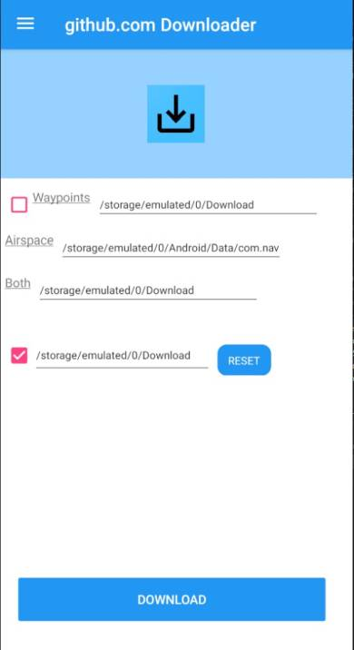
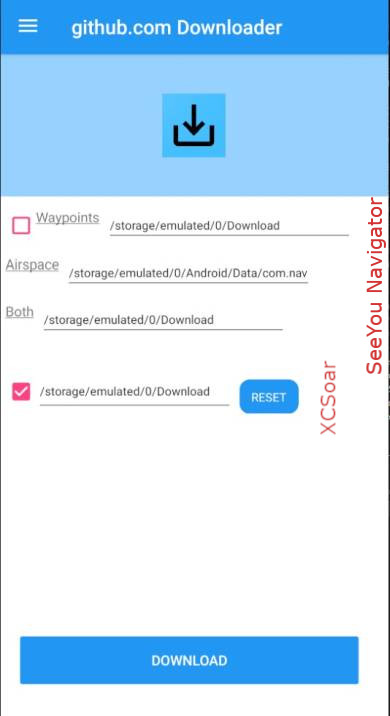

# Github Downloader
Android App to Donwload Airspace, Outlanding, Waypoints, ...  
Source repositories:  
https://github.com/planeur-net/airspace  
https://github.com/planeur-net/outlanding

  

## Files
Downloads the following files:  
https://planeur-net.github.io/airspace/france.txt  
https://planeur-net.github.io/airspace/france_openair_standard.txt  
https://planeur-net.github.io/outlanding/guide_aires_securite.cup  
https://planeur-net.github.io/outlanding/champs_des_alpes.cup  
https://planeur-net.github.io/outlanding/cols_des_alpes.cup  
https://planeur-net.github.io/outlanding/mountain_peaks_FR.cup  
https://planeur-net.github.io/outlanding/mountain_peaks_CH.cup  
https://planeur-net.github.io/outlanding/mountain_peaks_IT.cup  
https://planeur-net.github.io/outlanding/combined_guide+champs.xcsoar.zip  
https://planeur-net.github.io/outlanding/Misc/Ludo_waypoints.cup

## Download locations
Files are downloaded and saved to
| Option | Type | File location |
|---|---|---|
| SeeYou Navigator | Waypoints | /Android/Data/com.naviter.SeeYouNavigator/files/custom_waypoint |
| | Airspace | /Android/Data/com.naviter.SeeYouNavigator/files/custom_airspace |
| | Both | /Donwload |
| XCSoar | Airspace + Waypoints | /XCSoarData

  

### SeeYou Navigator
Waypoints: Waypoints files are copied to this location on the device.
Airspace: Airspace files are copied to this location on the device.
Both: Both Waypoints and Airspace files are copied to this location on the device.  
  
The "Waypoints" and "Airspace" location allow the files to be "automatically" updated by the application. The new files are used when SeeYouNavigator is restarted.  
The "Both" location allows you to use pick a new (never used before) file from SeeYou Navigator.

## XCSoar
XCSoar uses one file location only. Files in this location are taken into account by the application. 